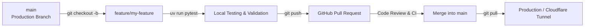

# Contributing to Shariah Algo Trader

Thank you for contributing to **Shariah Algo Trader**! This document outlines our development workflow, safety rules, architecture, and testing guidelines to ensure safe, reliable, and compliant collaboration.

---

## 1. Core Principles & Safety Guardrails

### Shariah Compliance Constraints
This project enforces strict Shariah-compliant algorithmic trading rules:
- **Long-only spot equities**: No shorting, margin, options, futures, or derivatives under any circumstances.
- **Strict Universe Compliance**: Positions may only be opened in equities currently present in the designated Shariah ETF holdings snapshot (e.g. `SPUS`).
- **Immediate Compliance Exit**: If a held stock leaves the universe snapshot, it must be liquidated immediately on the next daily compliance check.
- **Ubiquitous Language**: Use domain terms defined in [`CONTEXT.md`](./CONTEXT.md) (e.g., *Factor Score*, *Holdings Snapshot*, *Compliance Exit*, *Eligible Universe*).

### Financial & Code Safety Rules
- **NEVER Code Directly in Production**: Do not edit files on the machine actively running the live bot or serving `shariahtrading.my`.
- **NEVER Commit Live Secrets**: Keep all API keys in `.env` (which is gitignored). Use paper trading credentials for development.
- **All Tests Must Pass**: Automated tests (`uv run pytest`) must pass before submitting or merging changes. External APIs must be mocked in unit tests.

---

## 2. Environment Setup

### Prerequisites
- **Python**: 3.11 or newer
- **[uv](https://github.com/astral-sh/uv)**: Fast Python package and environment manager
- **Node.js**: 18+ & npm (required for dashboard/admin frontend development)

### Installation Steps

1. **Clone the repository**:
   ```bash
   git clone https://github.com/IlhamKassim/shariah-algo-trader.git
   cd shariah-algo-trader
   ```

2. **Set up Python dependencies**:
   ```bash
   uv sync
   ```

3. **Configure Environment Variables**:
   ```bash
   cp .env.example .env
   ```
   Edit `.env` with your **Alpaca Paper Trading** API keys:
   ```ini
   ALPACA_API_KEY=your_paper_key
   ALPACA_API_SECRET=your_paper_secret
   ALPACA_BASE_URL=https://paper-api.alpaca.markets
   ETF_SYMBOL=SPUS
   TOP_N=20
   ```

4. *(Optional)* **Set up Web Frontends**:
   ```bash
   # Dashboard frontend
   cd dashboard/web && npm install && cd ../..

   # Admin app frontend
   cd admin-app/web && npm install && cd ../..
   ```

---

## 3. Git & Collaboration Workflow

We follow a standard feature-branch workflow:



### Step 1: Create a Feature Branch
Always branch off the latest `main`:
```bash
git checkout main
git pull origin main
git checkout -b feature/your-feature-name
# or for bug fixes:
git checkout -b fix/issue-description
```

### Step 2: Make Changes & Test Locally
- Run tests regularly during development:
  ```bash
  uv run pytest
  ```
- To test the Factor Trading Bot:
  ```bash
  uv run shariah-trader
  ```
- To test the Day Trading Bot:
  ```bash
  uv run day-trader
  ```
- To run the Dashboard:
  - **Backend API**: `uv run uvicorn dashboard.api.main:app --reload --port 8000`
  - **Frontend Web**: In `dashboard/web`, run `npm run dev`
- To run the Admin App:
  - **Backend API**: `uv run uvicorn admin_app.api.main:app --reload --port 8002`
  - **Frontend Web**: In `admin-app/web`, run `npm run dev`

### Step 3: Commit and Push
Follow clean commit messages:
```bash
git add .
git commit -m "feat(factors): add low-volatility z-score calculation"
git push origin feature/your-feature-name
```

### Step 4: Open a Pull Request (PR)
1. Go to the GitHub repository and open a Pull Request against `main`.
2. Provide a clear summary of what was changed, why, and how it was tested.
3. Request a review from the repository maintainer.

---

## 4. Codebase Architecture

```
shariah-algo-trader/
├── shariah_algo_trader/       # Swing / Factor-based long-term strategy
│   ├── data/                 # ETF constituent scrapers & market data (yfinance)
│   ├── factors/              # Momentum, Quality, Low Volatility, Value scorers
│   ├── execution/            # Alpaca order execution & multi-tenant manager
│   ├── jobs/                 # Daily compliance check & monthly rebalance jobs
│   └── scheduling/           # APScheduler integration
│
├── day_trader/               # Intraday Gap & Go / ORB strategy
│   ├── signals/              # Gap detection, volume filters, breakout triggers
│   ├── execution/            # Intraday bracket orders & trailing stops
│   ├── state_persistence.py  # Runtime state tracking across bot restarts
│   └── jobs/                 # Intraday market scans & EOD liquidation
│
├── dashboard/
│   ├── api/                  # FastAPI backend (positions, auth, crypto, settings)
│   └── web/                  # React + TypeScript + Vite + TailwindCSS landing & dashboard
│
├── admin-app/
│   ├── admin_app/            # FastAPI admin API (:8002) for user approvals & spectate proxy
│   └── web/                  # Vite + React admin portal UI
│
├── tests/                    # Pytest suite (340+ unit & integration tests)
├── docs/                     # Architectural Decision Records (ADRs) & Agent guides
├── CONTEXT.md                # Domain terms, glossary, and strategy constraints
└── render.yaml               # Cloud deployment configuration
```

---

## 5. Testing & Verification Rules

1. **All new features and bugfixes must have tests** added in `tests/`.
2. **Never place live broker orders in tests**: Mock Alpaca and market data providers using `unittest.mock` or fixture data.
3. **Run the full test suite**:
   ```bash
   uv run pytest
   ```
4. Verify individual test modules when working on specific components:
   ```bash
   uv run pytest tests/test_scorer.py
   uv run pytest tests/test_compliance_check.py
   ```

---

## 6. Production Deployment & Cloudflare Tunnel

The live application is served locally and exposed via Cloudflare Tunnel to `shariahtrading.my`.

### Deploying Updates to the Host Server
Once your PR is merged into `main`:
1. On the host server machine, pull the latest code:
   ```bash
   git checkout main
   git pull origin main
   ```
2. Update dependencies:
   ```bash
   uv sync --no-dev
   ```
3. If frontend changes were made, build the frontend bundles:
   ```bash
   # Dashboard
   cd dashboard/web && npm install && npm run build && cd ../..
   # Admin portal (if applicable)
   cd admin-app/web && npm install && npm run build && cd ../..
   ```
4. Restart the bot / dashboard services (e.g., via `systemd` or `launchd`).

---

## 7. Architectural Decisions (ADR)

Significant architectural changes (such as new trading strategies, broker changes, or state storage engines) should be documented as an ADR in `docs/adr/`.

See existing ADRs in [`docs/adr/`](./docs/adr/) for examples.
