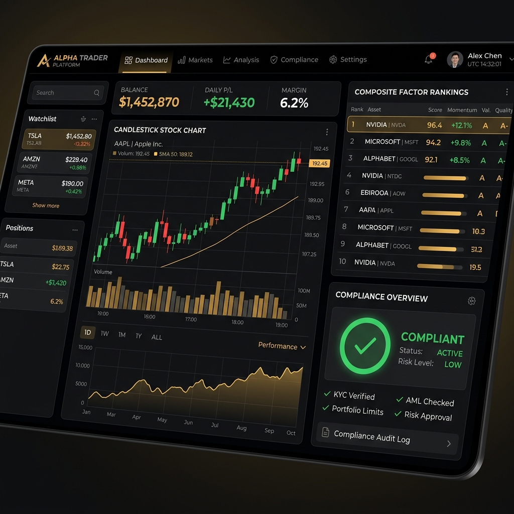

# Shariah Algo Trader

<div align="center">

[](#)
[](#)
[](#)
[](#)
[](#)

</div>

An algorithmic trading bot that operates exclusively within a Shariah-compliant equity universe, taking long-only spot positions with no leverage, margin, derivatives, or options. 

The strategy scoring rank is computed using an equal-weighted combination of four factor z-scores (Momentum, Quality, Low Volatility, and Value) drawn from the Eligible Universe—defined by the constituent holdings of a designated Shariah-compliant ETF such as `SPUS`.

---

## 🖥️ Live Dashboard Preview

Here is a visual mockup of the dark-gold monospaced trading dashboard console:



---

## 🎯 Features

- **Dynamic Eligible Universe**: Automatically synchronizes with Shariah-compliant ETF constituents holdings snapshots (e.g. SPUS, HLAL) to define the pool of tradable assets.
- **Factor-Based Allocation**: Scores assets using a 4-Factor system:
  - **Momentum Factor**: Peering 12-month return performance minus short-term 1-month reversal.
  - **Quality Factor**: Metrics of ROE, profit stability, and debt-ratio screenings.
  - **Low Volatility Factor**: Evaluates volatility profiles to allocate heavier weights to lower-volatility items.
  - **Value Factor**: Evaluates PE/PB ratios.
- **Stateless Compliance Guard**: Executes a daily **Compliance Check** against the holdings snapshot at NYSE market open, triggering an immediate **Compliance Exit** (forced sale) if a stock leaves the Shariah ETF.
- **Monthly Rebalancing**: Computes factor ranks and re-weights the top-20 stocks on the first trading day of each month.
- **Sleek Admin Console**: Full React + TypeScript SPA console styled with a premium pitch-black, dark gold terminal theme.
- **Console Security**:
  - **Password Protection**: Restricts API endpoints behind standard console key password logins.
  - **Google OAuth2 Sign-In**: Authenticates sessions via Google, restricted to a whitelisted set of administrator emails.
  - **Outbound Tunneling Ready**: Fully compatible with Cloudflare Zero Trust Tunnels for secure exposure without open incoming ports.

---

## 🛠️ Setup

### Prerequisites
- Python 3.11+
- [uv](https://github.com/astral-sh/uv) (fast Python package manager)
- Node.js (for frontend compilation during development)

### 1. Clone & Install Dependencies
```bash
git clone <repo-url>
cd shariah-algo-trader

# Install Python virtual environment & workspace dependencies
uv sync --extra dev
```

### 2. Configure Environment
Copy the `.env.example` file and populate it with your broker and data provider keys:
```bash
cp .env.example .env
```

Open `.env` and fill in the values:
```env
# Alpaca paper broker credentials
ALPACA_API_KEY=your_alpaca_api_key
ALPACA_API_SECRET=your_alpaca_api_secret
ALPACA_BASE_URL=https://paper-api.alpaca.markets

# Financial Modeling Prep (market data)
FMP_API_KEY=your_fmp_api_key

# ETF Universe (e.g. SPUS) and Portfolio size
ETF_SYMBOL=SPUS
TOP_N=20

# Optional: Enable dashboard password console protection
DASHBOARD_PASSWORD=your_secure_password_here

# Optional: Enable Google OAuth2 sign-in
GOOGLE_CLIENT_ID=your_client_id.apps.googleusercontent.com
GOOGLE_CLIENT_SECRET=GOCSPX-your_client_secret
GOOGLE_REDIRECT_URI=https://shariahtrading.my/api/auth/google/callback
ALLOWED_GOOGLE_EMAILS=yourname@gmail.com
```

---

## 🚀 Running the System

### Running the Trading Bot
The bot runs a blocking process that triggers jobs according to the NYSE calendar:
```bash
# Direct run
uv run python main.py

# Or via the console script shortcut
uv run shariah-trader
```
The Scheduler fires daily at `09:30 ET` for **Compliance Checks** and monthly on the first trading day for **Rebalances**.

### Starting the Dashboard Console
1. Compile the React frontend assets (only needed during development):
   ```bash
   cd dashboard/web
   npm run build
   cd ../..
   ```
2. Start the FastAPI backend server:
   ```bash
   uv run uvicorn dashboard.api.main:app --host 0.0.0.0 --port 8000
   ```
   Open **http://localhost:8000** in your browser.

---

## 🧪 Testing

Run pytest to verify the full suite of 170+ unit and integration tests (including the mocked Google OAuth2 callbacks):
```bash
uv run pytest
```

---

## 📂 Project Layout

```
shariah-algo-trader/
├── shariah_algo_trader/    # Core Python trading logic
│   ├── config.py           # Configuration loading & validation
│   ├── main.py             # Main entry point (scheduler loop)
│   ├── data/               # ETF constituents snapshots
│   ├── factors/            # Momentum, Quality, and Value scoring
│   ├── execution/          # Alpaca broker connections
│   └── jobs/               # Compliance checks and monthly rebalances
├── dashboard/              
│   ├── api/                # FastAPI backend endpoints
│   │   ├── routers/        # Routers (auth, account, universe, etc.)
│   │   └── static/         # Compiled React production bundle
│   └── web/                # React + Vite + TypeScript source
├── tests/                  # Pytest unit testing suites
├── docs/                   # Documentation and diagrams
├── pyproject.toml          # uv python project metadata
└── README.md               # Visual systems overview
```
