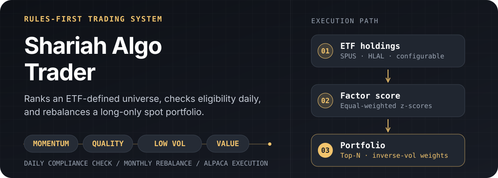
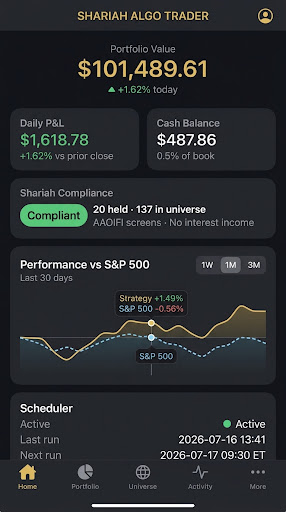

# Shariah Algo Trader

<p align="center">
  
</p>

<p align="center">
  <a href="https://www.python.org/"></a>
  <a href="https://fastapi.tiangolo.com/"></a>
  <a href="https://react.dev/"></a>
  <a href="https://github.com/astral-sh/uv"></a>
</p>

Shariah Algo Trader is a rules-first trading system for **long-only US spot equities**. It builds an eligible universe from designated Shariah ETF holdings, ranks that universe with four equal-weighted factors, and sends orders through Alpaca.

The system is designed for paper trading first. It does not use leverage, margin, short selling, options, or futures.

> **Compliance scope.** ETF membership is the primary eligibility source. The project adds a supplementary debt-to-assets screen and does not claim independent board-certified or full AAOIFI compliance. Read the [domain model](CONTEXT.md) before changing terminology or rules.

## See the system

The repository includes a public landing page, a trading console, and a portfolio view. These screenshots show the current interface rather than a mockup.

<p align="center">
  
  
  
</p>

## How a trading decision is made

| Stage | What happens | Schedule |
| --- | --- | --- |
| Eligible Universe | Combine configured ETF holdings, then keep US-listed symbols that Alpaca can trade. | Holdings refresh |
| Factor Score | Compute Momentum, Quality, Low Volatility, and Value z-scores. Each contributes 25%. | Before a rebalance |
| Portfolio | Select the top `TOP_N` symbols and size them with inverse-volatility weights, subject to the sector cap. | Monthly, first NYSE trading day |
| Compliance Check | Compare every held symbol with the latest universe. A missing symbol triggers an immediate Compliance Exit. | Every NYSE trading day at market open |
| Execution | Read current positions from Alpaca and submit long-only spot orders. | During each job |

The important distinction is between a **Rebalance** and a **Compliance Exit**. A rebalance changes the portfolio because ranks changed. A compliance exit sells a holding because it left the eligible universe, even if the next rebalance is still weeks away.

## The four factors

- **Momentum:** trailing 12-month return minus the most recent 1-month return, which reduces short-term reversal effects.
- **Quality:** profitability and earnings consistency measures, with the supplementary debt-to-assets screen.
- **Low Volatility:** lower annualized price volatility receives a higher factor score.
- **Value:** relative P/E and P/B measures where the required market data is available.

The composite rank is the equal-weighted sum of those four z-scores. Portfolio weights are then calculated from inverse volatility and limited by `SECTOR_CAP`.

## Start with paper trading

### Requirements

- Python 3.11 or newer
- [`uv`](https://docs.astral.sh/uv/)
- Node.js, only when rebuilding the dashboard frontend
- Paper credentials for [Alpaca](https://alpaca.markets/)
- An FMP API key, if you use the backtesting fundamentals provider

### Install

```bash
git clone <repo-url>
cd shariah-algo-trader
uv sync --extra dev
```

Copy the root [`.env.example`](.env.example) to `.env`. Start with Alpaca's paper endpoint and keep secrets out of Git:

```bash
cp .env.example .env
```

At minimum, configure `ALPACA_API_KEY`, `ALPACA_API_SECRET`, `ALPACA_BASE_URL`, `ETF_SYMBOL`, and `TOP_N`. The example file documents optional ETF combinations, dashboard authentication, Supabase, and Google OAuth settings.

### Verify the checkout

```bash
uv run pytest
```

### Run the scheduler

```bash
uv run python main.py
# or
uv run shariah-trader
```

The scheduler uses the NYSE calendar. It runs the daily Compliance Check at market open and the monthly Rebalance on the first trading day of the month.

### Run the dashboard locally

Build the React frontend when its source changes, then start the FastAPI app:

```bash
cd dashboard/web
npm run build
cd ../..
uv run uvicorn dashboard.api.main:app --host 127.0.0.1 --port 8000
```

Open <http://127.0.0.1:8000>. Use `0.0.0.0` only when you understand the network exposure and have authentication and transport protection configured.

## Project layout

```text
shariah-algo-trader/
├── shariah_algo_trader/
│   ├── data/          ETF universe and market data providers
│   ├── factors/       Momentum, Quality, Low Volatility, and Value
│   ├── execution/     Alpaca client and order execution
│   ├── jobs/          Compliance checks and rebalances
│   └── scheduling/    NYSE-aware scheduler
├── dashboard/
│   ├── api/           FastAPI routes, auth, hardening, and storage
│   └── web/           React + Vite dashboard source
├── tests/             Unit and integration coverage
├── docs/              Architecture, ADRs, operating notes, and screenshots
├── .env.example       Configuration template
└── pyproject.toml     Python project metadata and commands
```

## Security and operating boundaries

- Use paper credentials while developing and testing.
- Keep API keys, OAuth secrets, encryption keys, and JWT secrets in environment variables or a secret manager.
- The dashboard supports authentication, rate limiting, CSP hardening, and per-user credential isolation. See [`dashboard/api/`](dashboard/api/) and [`docs/ARCHITECTURE.md`](docs/ARCHITECTURE.md).
- Live trading uses the same Alpaca API path as paper trading with a different base URL and credentials. Treat the mode switch as a production change.
- The system is not investment advice. Backtests and factor ranks do not guarantee future returns.

## Further reading

- [Architecture and component design](docs/ARCHITECTURE.md)
- [Multi-broker support roadmap](docs/multi-broker-support.md)
- [Performance and alpha notes](docs/PERFORMANCE_ALPHA_EXPLAINED.md)
- [Architecture decision records](docs/adr/)
- [Contribution guide](CONTRIBUTING.md)

## License

This project is licensed under the [MIT License](LICENSE).
