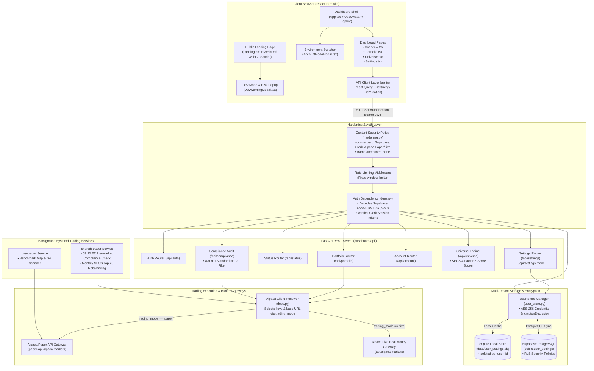

# Shariah Algo Trader — System Architecture & Component Design

This document details the architectural design of the Shariah Algo Trader platform, illustrating the interaction between the **Frontend (React 19 + Vite)**, **Backend (FastAPI)**, **Multi-Tenant Encrypted Data Store (SQLite + Supabase)**, **Authentication Gateways (Supabase / Clerk)**, and **Alpaca Trading Execution Environments (Paper vs. Live Real Money)**.

---

## 📐 High-Level Architecture Diagram



---

## 🛠️ Detailed Component Breakdown

### 1. **Frontend Architecture (`dashboard/web/src/`)**
* **Vite + React 19**: Ultra-fast component rendering with React Query managing API state caching and background refetching every 30s.
* **Aesthetics & Motion**: Dark glassmorphic design system using Tailwind CSS, monospaced typography, and Framer Motion micro-interactions.
* **Environment Switcher**:
  * Topbar pill displays `PAPER ACCOUNT` or `🔴 LIVE REAL MONEY`.
  * Clicking pill opens `AccountModeModal.tsx` to toggle environments.
* **Dynamic User Avatar**: `UserAvatar.tsx` resolves profile images or 2-letter uppercase initials from Supabase Auth, Clerk, or Google OAuth.

---

### 2. **Security & API Hardening (`dashboard/api/hardening.py`, `deps.py`)**
* **Strict CSP Header**:
  ```http
  Content-Security-Policy: default-src 'self'; connect-src 'self' https://*.supabase.co https://*.clerk.accounts.dev https://api.alpaca.markets https://paper-api.alpaca.markets; ...
  ```
* **Supabase JWT Verification (`_decode_supabase_jwt`)**:
  * Verifies Supabase **ES256 (ECDSA)** tokens against Supabase JWKS endpoint (`https://<project>.supabase.co/auth/v1/.well-known/jwks.json`).
* **Multi-Tenant State Isolation**:
  * All endpoint requests extract the verified `user_id` from request state, isolating settings and API credentials per user.

---

### 3. **Multi-Tenant Storage & Encryption (`dashboard/api/user_store.py`)**
* **AES-256 Credential Encryption**: API keys and secrets are encrypted in-memory before saving to disk via `encrypt_credential()` and decrypted on retrieval via `decrypt_credential()`.
* **Isolated Schemas**:
  ```sql
  CREATE TABLE user_settings (
      user_id                          TEXT PRIMARY KEY,
      alpaca_api_key_encrypted          TEXT,
      alpaca_api_secret_encrypted       TEXT,
      alpaca_live_api_key_encrypted     TEXT,
      alpaca_live_api_secret_encrypted  TEXT,
      trading_mode                     TEXT DEFAULT 'paper',
      alpaca_base_url                   TEXT DEFAULT 'https://paper-api.alpaca.markets',
      etf_symbol                        TEXT DEFAULT 'SPUS',
      top_n                             INTEGER DEFAULT 20,
      sector_cap                        REAL DEFAULT 0.20,
      drift_threshold                   REAL DEFAULT 0.03,
      created_at                        TEXT NOT NULL,
      updated_at                        TEXT NOT NULL
  );
  ```

---

### 4. **Execution Gateway & Trading Mode Switching (`deps.py`, `alpaca_client.py`)**
* **Automatic Endpoint Resolution**:
  * If `trading_mode == "live"`, `get_alpaca` uses `alpaca_live_api_key`, `alpaca_live_api_secret`, and `https://api.alpaca.markets`.
  * If `trading_mode == "paper"`, `get_alpaca` uses paper credentials and `https://paper-api.alpaca.markets`.
* **Zero-Risk Testing**: Users can test quantitative factor ranking in Paper mode before enabling Live Real Money execution.

---

### 5. **Quantitative Factor Engine & Compliance Screening**
* **4-Factor Composite Scoring Engine (`universe.py`)**:
  1. **Momentum (12M-1M)**: Peers 12-month return minus 1-month reversal.
  2. **Quality (ROE)**: Return on equity and debt-ratio screening.
  3. **Low Volatility**: Peering annualized standard deviation.
  4. **Value (P/E, P/B)**: Valuation z-scores.
* **AAOIFI Compliance Guard (`compliance.py`)**:
  * Verifies 100% Long-Only Spot Equity (no options, futures, margin, or shorting).
  * Enforces 33% debt-to-asset limits and immediate compliance exit liquidations on market open.
