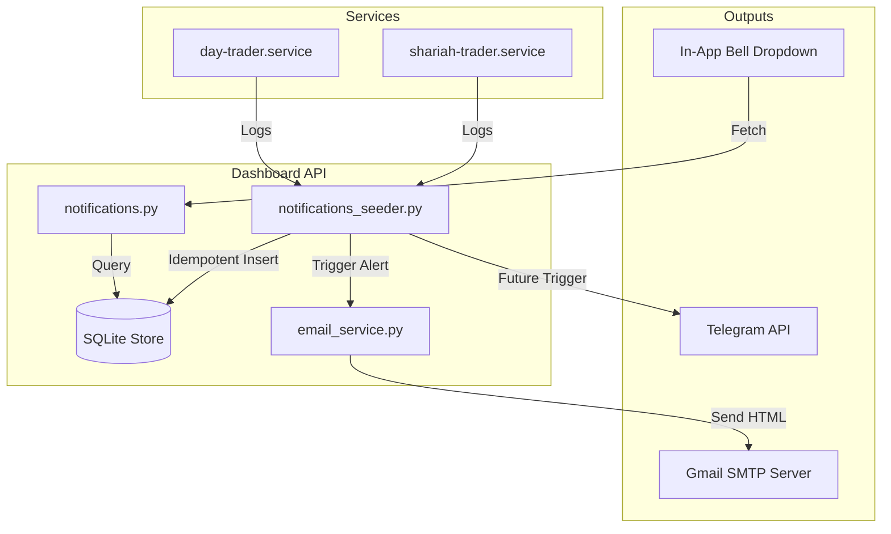

# [EPIC] End-to-End Notification System Roadmap #0

**Type:** Epic / Roadmap  
**Milestone:** v1.2 — Messaging & Alerts  
**Status:** In Progress (Phases 1 & 2 Completed)  
**Assignee:** @antigravity  

---

## 📖 Overview
To transition our Shariah Algo Trader & Day Trader bots from a set of personal scripts to a **SaaS platform**, we require a robust notification engine. The engine notifies users of critical events (compliance checks, rebalances, executions, broker rejections) through multiple channels based on user preferences.

This issue serves as the master checklist and architecture overview tracking all phases of the notification system lifecycle.

---

## 🗺️ Implementation Phases

### 🟢 Phase 1: In-App Notification Bell
*Status: Completed ✅*
* **Description:** Add an inline alert center to the dashboard so users get instant audit updates without leaving the web client.
* **Key Components Shipped:**
  * Thread-safe SQLite store (`data/notifications.db`) to log events with a 30-day retention window.
  * Startup log seeder (`notifications_seeder.py`) parsing `journalctl` logs.
  * In-app bell dropdown component (`NotificationBell.tsx`) polling every 30s.
  * Centered detail popups showing severity tags and context.
  * Local preferences panel to mute specific sources (e.g., mute Day Trader alerts).

---

### 🟢 Phase 2: Email Alerts & Digests
*Status: Completed ✅*
* **Description:** Send immediate transaction alerts for high-severity anomalies, and consolidate daily actions into a post-market summary.
* **Key Components Shipped:**
  * Outgoing SMTP dispatcher client (`email_service.py`).
  * Persistently looping background log monitor (checks logs every 30s).
  * Real-time warning/critical email alerts (with startup-spam prevention rules).
  * Auto-compile daily summaries sent at 16:30 Eastern Time.
  * Dynamic recipient routing: falls back to whitelisted Google OAuth emails if no target address is set.
  * Georgia-serif editorial styling with the platform's unicode trend logo `↗`.
  * Embedded live portfolio metrics (Daily P&L, Equity, and benchmark comparisons against SPUS/SPY).

---

### 🔵 Phase 3: Real-Time Telegram Integration
*Status: Backlog 📋 (See Issue #1 for details)*
* **Description:** Integrate Telegram Bot API to push execution events directly to messaging channels.
* **Planned Tasks:**
  * Extend database to support `telegram_bot_token` and `telegram_chat_id` config keys.
  * Add Telegram token fields to Settings (obfuscated by default).
  * Create `telegram_service.py` to handle outgoing sendMessage payloads.
  * Build a "Test Connection" button to verify Telegram bot credentials.
  * Route warning and trade entry events to active Telegram chats.

---

### 🔵 Phase 4: SaaS Multi-Tenancy & Preferences
*Status: Backlog 📋*
* **Description:** Support multi-user accounts where users specify their own routing rules, notification categories, and premium tiers.
* **Planned Tasks:**
  * Upgrade the SQLite store to support user foreign keys (`user_id`).
  * Build a notification preferences panel in Settings allowing users to customize toggles per channel (e.g., *Email: Digests Only*, *Telegram: Trades Only*).
  * Limit Telegram push alerts to premium subscription tiers.
  * Add a system administration dashboard showing SMTP queue status, delivery statistics, and webhook dispatch lists.

---

## 🏛️ System Architecture

---

## 📋 Definition of Done (Epic Complete)
* [x] In-app notifications display trades, compliance passes, and warnings.
* [x] Settings page has a password lock overlay to protect API keys.
* [x] Users get immediate email alerts for critical system failures.
* [x] Users receive daily email summaries showing portfolio returns vs benchmarks.
* [ ] Users can toggle Telegram channel notifications in Settings.
* [ ] Multiple accounts receive alerts independently (SaaS multi-tenant mode).
